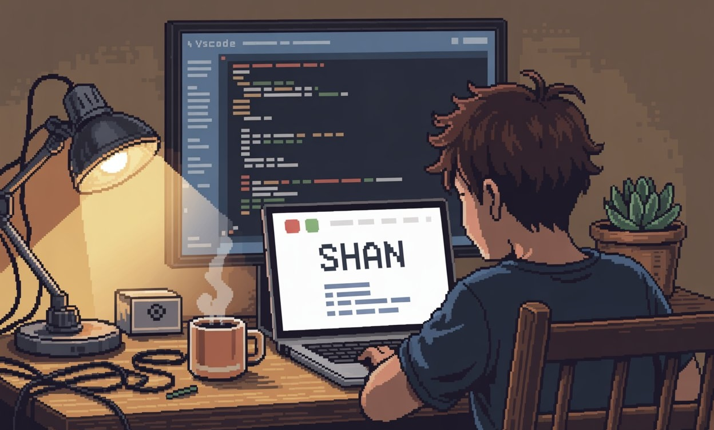

  

<h1 align="center">Ich grüße Sie 🙏 I'm Shan Padayhag</h1>

<h4 align="left">🌟 With a solid background in software engineering, I'm now focused on advancing my skills in cybersecurity—particularly in penetration testing and ethical hacking. My current learning journey revolves around offensive security, including network exploitation, vulnerability assessment, and refining my bug bounty workflow. I aim to build a long-term career in offensive security, contributing to securing systems through hands-on, proactive defense strategies.</h4>

  

  

  

 

<table width="100%">
  <tr>
    <td align="left" valign="middle" width="66%">
      <h3>💫 About Me</h3>
      <h4>🔐 I'm currently focused on strengthening my cybersecurity profile—diving deep into penetration testing and ethical hacking to prepare for a role in offensive security. 🤝 I'm looking to collaborate on security-focused projects, CTF challenges, or red team simulations. 🧠 I'm looking for help with mastering advanced pentesting techniques, especially in web app and mobile security. 🌱 I'm currently learning network exploitation, vulnerability assessment tools, and refining my bug bounty workflow. 💬 Ask me about penetration testing, cybersecurity fundamentals, or software engineering. ⚡️ Fun fact: Table tennis helps me serve up fresh ideas!</h4>
    </td>
    <td align="right" valign="middle" width="34%">
      
    </td>
  </tr>
</table>

  <h3>🧲 Connect me :</h3>
  

  

  

<h3 align="center">🌱 Github Status</h3>

  
  

<h3 align="center">📚 Languages & Tools I’ve Worked With</h3>

   
     
     
     

  <h3>⭐️ Best Repositories</h3>
  

    
    

<h3>💻 Tech Stack:</h3>
 

   
  
  
  
  
  
  
  
  
  
  
  

<h3>⭐ Top Contributed Repo!</h3>
 

